# IM即时通信产品技术方案评估报告

**报告日期**: 2026-03-30
**项目**: 全栈全端IM即时通信产品
**评估重点**: 技术可行性、架构合理性、与其他方案对比

---

## 执行摘要

本报告评估了采用 **Java后端 + Flutter前端** 实现全栈全端IM即时通信产品的技术可行性，并与主流技术方案进行对比分析。

**核心结论**：该技术栈在AI编程模式下具有**高可行性**，具备成熟的生态系统、优秀的性能表现和强大的可扩展性，推荐作为首选方案。

---

## 1. 目标技术方案：Java后端 + Flutter前端

### 1.1 整体架构

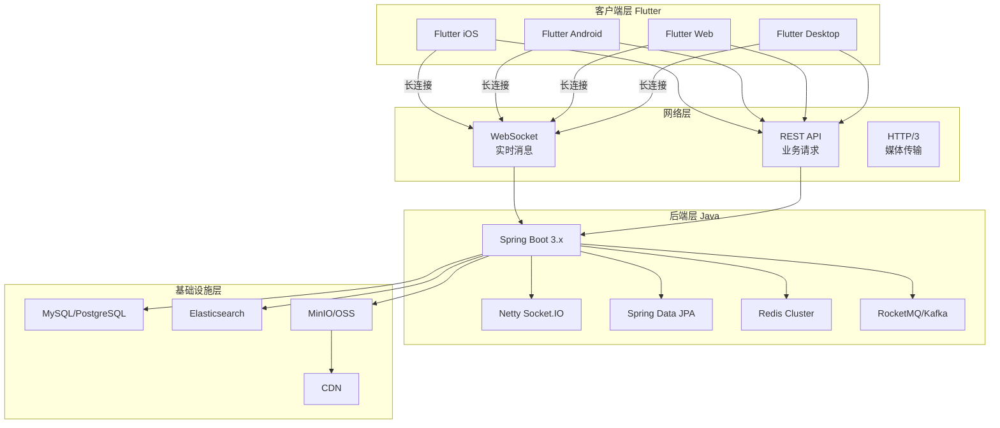

### 1.2 核心技术栈详细分析

#### 后端技术栈 (Java)

| 技术 | 版本推荐 | 作用 | 优势 |
|------|---------|------|------|
| **Spring Boot** | 3.2+ (JDK 21) | 应用框架 | 成熟生态、快速开发、微服务友好 |
| **Netty** | 4.1.x | WebSocket服务器 | 高性能事件驱动、百万级连接支持 |
| **Spring Data JPA** | 3.2+ | ORM框架 | 类型安全、Repository模式 |
| **Redis** | 7.x | 缓存/会话/分布式锁 | 高性能、丰富的数据结构 |
| **MySQL/PostgreSQL** | 8.0+ / 16+ | 主数据库 | ACID事务、可靠性 |
| **Elasticsearch** | 8.x | 消息搜索/日志 | 全文检索、分布式 |
| **RocketMQ/Kafka** | 5.x / 3.6+ | 消息队列 | 高吞吐、削峰填谷 |

#### 前端技术栈 (Flutter)

| 技术 | 作用 | 优势 |
|------|------|------|
| **Flutter 3.x** | 跨平台UI框架 | 单一代码库、原生性能、热重载 |
| **Provider/Riverpod** | 状态管理 | 简单易用、性能优秀 |
| **WebSocket** | 实时通信 | Flutter内置支持 |
| **Hive/Isar** | 本地存储 | 高性能NoSQL数据库 |

### 1.3 IM系统关键模块设计

#### 消息流转流程

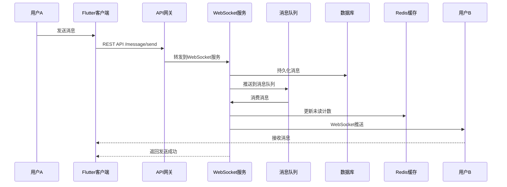

#### 连接管理架构

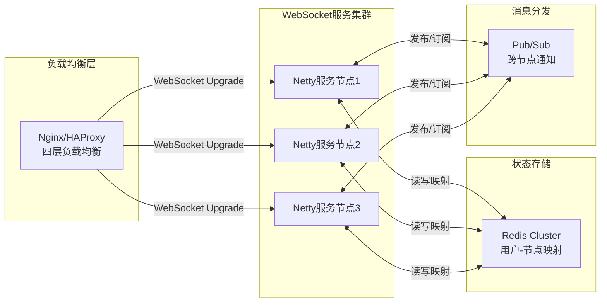

### 1.4 可行性评估

| 评估维度 | 评分 | 说明 |
|---------|------|------|
| **技术成熟度** | ⭐⭐⭐⭐⭐ | Java和Flutter均有成熟的生产级案例 |
| **性能表现** | ⭐⭐⭐⭐⭐ | Java虚拟机优化 + Flutter原生渲染 |
| **开发效率** | ⭐⭐⭐⭐ | AI编程大幅降低技术门槛 |
| **扩展性** | ⭐⭐⭐⭐⭐ | 微服务架构 + 云原生支持 |
| **生态支持** | ⭐⭐⭐⭐⭐ | 丰富的开源库和社区资源 |
| **维护成本** | ⭐⭐⭐⭐ | 类型安全 + 工具链完善 |

---

## 2. 其他技术方案对比

### 2.1 方案对比总览

| 方案 | 后端 | 前端 | 性能 | 开发效率 | 生态 | 推荐指数 |
|------|------|------|------|---------|------|---------|
| **方案A** | Java | Flutter | ⭐⭐⭐⭐⭐ | ⭐⭐⭐⭐ | ⭐⭐⭐⭐⭐ | 🟢 强烈推荐 |
| **方案B** | Node.js | React Native | ⭐⭐⭐ | ⭐⭐⭐⭐⭐ | ⭐⭐⭐⭐ | 🟡 可选 |
| **方案C** | Go | Flutter | ⭐⭐⭐⭐⭐ | ⭐⭐⭐ | ⭐⭐⭐ | 🟡 可选 |
| **方案D** | Java | React Native | ⭐⭐⭐⭐ | ⭐⭐⭐⭐ | ⭐⭐⭐⭐ | 🟡 可选 |
| **方案E** | Spring Boot + Vue | Web应用 | ⭐⭐⭐⭐ | ⭐⭐⭐⭐⭐ | ⭐⭐⭐⭐ | 🔴 不推荐（原生体验差） |

### 2.2 详细方案分析

#### 方案B: Node.js后端 + React Native前端

**技术栈**:
- 后端: Node.js + NestJS + Socket.IO
- 前端: React Native + Redux/Zustand

**架构图**:
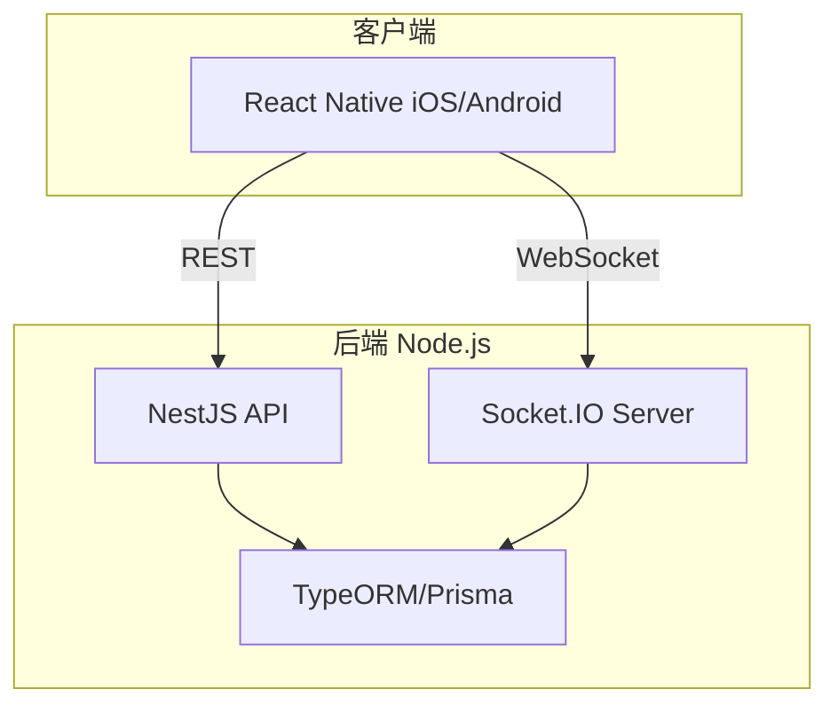

**优势**:
- 前后端统一使用TypeScript，减少上下文切换
- React Native生态更丰富，第三方组件更多
- Node.js在I/O密集型场景下表现良好

**劣势**:
- Node.js单线程特性，高CPU负载时性能受限
- WebSocket连接数受限，需要PM2集群模式
- 长期稳定性不如Java虚拟机

**适用场景**: 快速原型开发、中小型IM应用

---

#### 方案C: Go后端 + Flutter前端

**技术栈**:
- 后端: Go + Gin/Echo + Gorilla WebSocket
- 前端: Flutter

**架构图**:
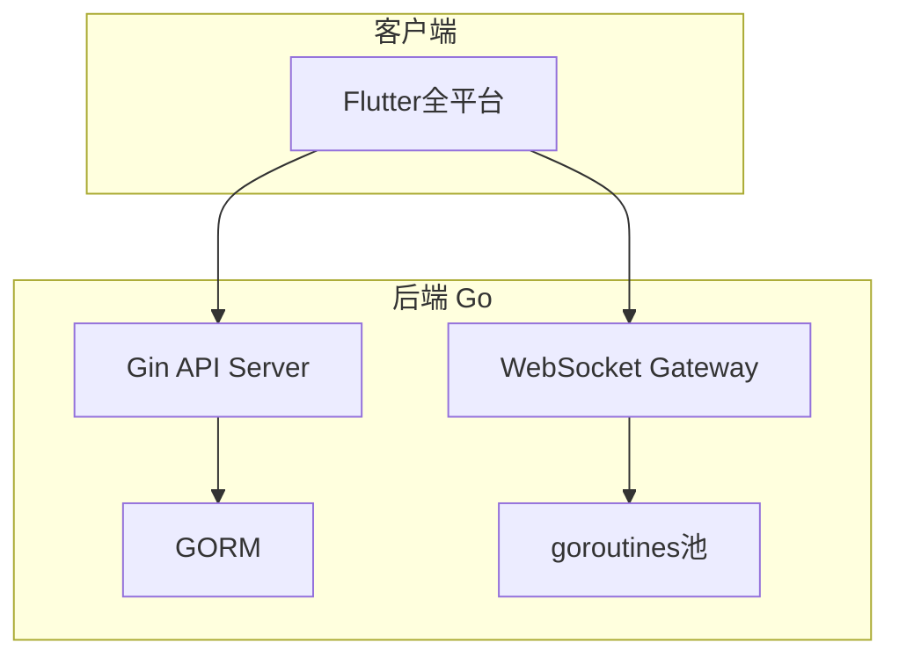

**优势**:
- Go协程处理并发连接性能优异
- 编译型语言，启动速度快
- 内存占用低，适合大规模部署

**劣势**:
- Go生态不如Java成熟，尤其企业级组件
- 错误处理机制（error返回值）较为繁琐
- 反射能力弱，框架开发不如Java灵活

**适用场景**: 对性能极致要求、团队熟悉Go语言

---

#### 方案D: Java后端 + React Native前端

**技术栈**:
- 后端: Spring Boot 3.x
- 前端: React Native + Redux

**优势**:
- 保留Java后端的优势
- React Native生态更丰富

**劣势**:
- 前端团队需要维护两套技术栈（React + Dart）
- 不如Flutter跨平台一致性高

**适用场景**: 已有React Native团队或现有项目迁移

---

#### 方案E: 纯Web方案

**技术栈**:
- 后端: Spring Boot
- 前端: Vue 3 + WebSocket + PWA

**架构图**:
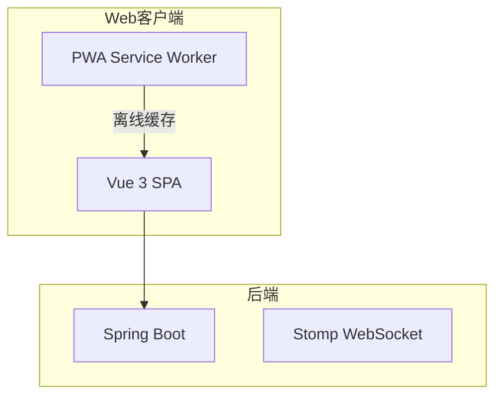

**优势**:
- 开发效率最高
- 跨平台天然支持

**劣势**:
- 原生体验差，性能受限
- 后台消息推送依赖浏览器能力
- 不适合商业级IM产品

**适用场景**: 内部工具、轻量级即时通讯

---

### 2.3 技术方案决策矩阵

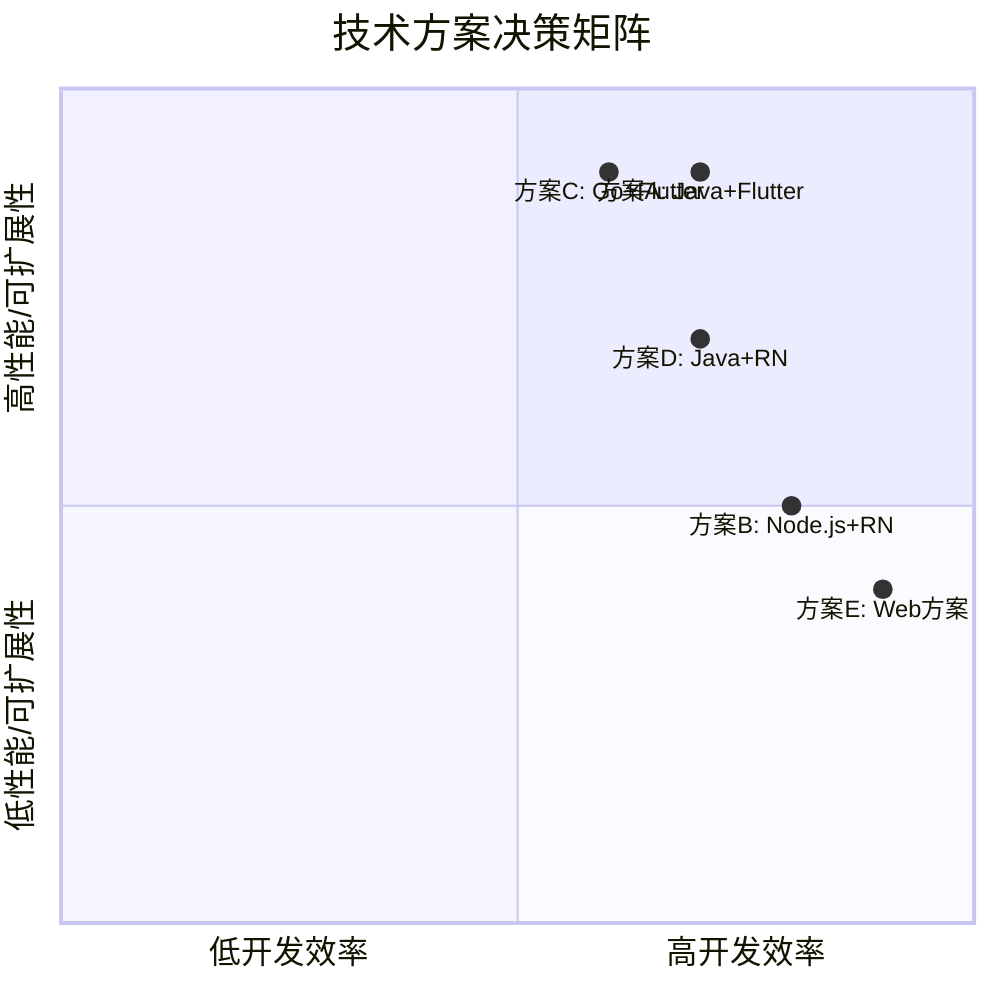

---

## 3. IM系统关键技术挑战与解决方案

### 3.1 消息可靠投递

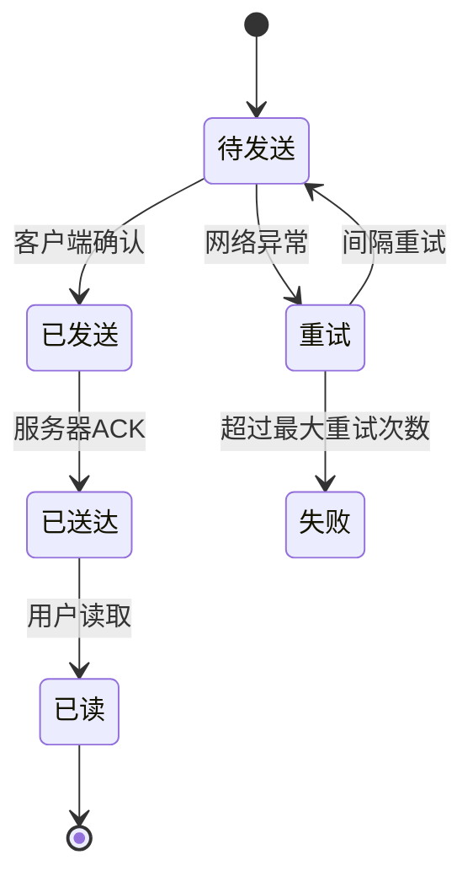

**技术实现**:
- 使用RocketMQ保证消息持久化
- 客户端ACK机制确认投递
- 离线消息存储在数据库

### 3.2 高并发连接处理

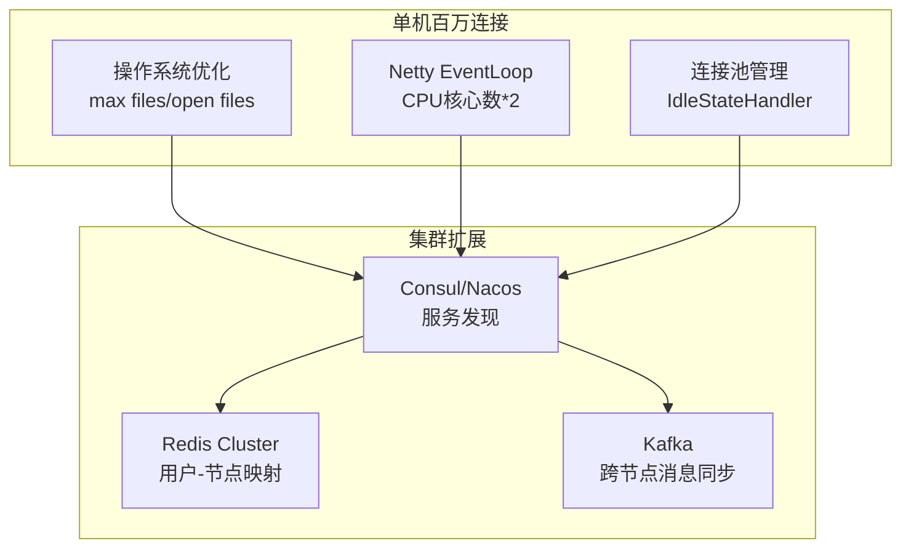

### 3.3 消息顺序保证

**方案**: 使用Snowflake ID生成全局唯一有序ID
```
时间戳(41bit) + 机器ID(10bit) + 序列号(12bit)
```

### 3.4 消息去重

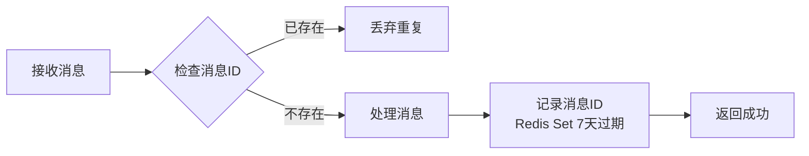

---

## 4. 推荐方案详细设计

### 4.1 项目结构

```
vibeCodingDemo/
├── backend/                    # Java后端
│   ├── im-api/                # API网关
│   ├── im-auth/               # 认证服务
│   ├── im-chat/               # 聊天服务
│   ├── im-push/               # 推送服务
│   ├── im-user/               # 用户服务
│   └── im-common/             # 公共模块
├── frontend/                  # Flutter前端
│   ├── lib/
│   │   ├── pages/
│   │   ├── widgets/
│   │   ├── services/
│   │   └── models/
└── docs/                      # 文档
```

### 4.2 核心技术选型理由

| 技术 | 选型理由 |
|------|---------|
| **Spring Boot 3.x** | 微服务标准框架，生态完善 |
| **Netty** | 高性能异步事件驱动，百万级连接 |
| **Redis Cluster** | 分布式缓存 + Pub/Sub |
| **RocketMQ** | 可靠消息投递 + 顺序消息 |
| **Flutter 3.x** | 原生性能 + 单一代码库 |
| **Hive** | Flutter本地高性能NoSQL |

### 4.3 性能指标预估

| 指标 | 目标值 |
|------|-------|
| 单机WebSocket连接数 | 10万+ |
| 消息端到端延迟 | <100ms |
| 消息吞吐量 | 10万条/秒 |
| 消息送达率 | 99.99% |
| 系统可用性 | 99.9% |

---

## 5. 风险评估与缓解措施

### 5.1 技术风险

| 风险 | 影响 | 概率 | 缓解措施 |
|------|------|------|---------|
| WebSocket连接稳定性 | 高 | 中 | 心跳机制 + 自动重连 |
| 消息顺序错乱 | 高 | 低 | 全局有序ID + 分区消息队列 |
| 内存泄漏 | 中 | 中 | 定期监控 + Netty对象池 |
| 大文件传输 | 中 | 中 | 分片上传 + 断点续传 |

### 5.2 业务风险

| 风险 | 影响 | 概率 | 缓解措施 |
|------|------|------|---------|
| 消息丢失 | 高 | 低 | 持久化 + 重试机制 |
| 并发冲突 | 中 | 中 | 乐观锁 + 分布式锁 |
| 数据一致性 | 高 | 中 | 最终一致性 + 补偿机制 |

---

## 6. 实施路线图

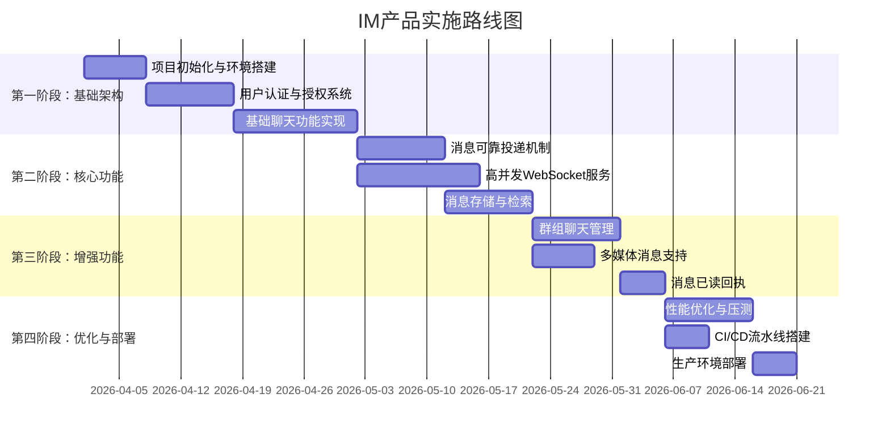

---

## 7. 结论与建议

### 7.1 核心结论

1. **Java后端 + Flutter前端方案具有高可行性**，技术栈成熟、性能优异、扩展性强
2. 该方案适合构建**商业级、大规模**IM即时通信产品
3. 在AI编程模式下，技术学习成本不再是主要障碍

### 7.2 最终推荐

**首选方案**: Java (Spring Boot 3.x + Netty) + Flutter 3.x

**理由**:
- ✅ Java虚拟机在长连接、高并发场景下经过充分验证
- ✅ Spring生态提供完善的企业级组件支持
- ✅ Flutter提供接近原生的跨平台体验
- ✅ 两个技术栈都有活跃的AI代码生成能力
- ✅ 适合长期维护和团队扩展

**备选方案**: 如团队已有Node.js/React Native经验，可考虑方案B作为快速原型开发。

### 7.3 下一步行动

1. 搭建基础开发环境（Java 21 + Flutter 3.x）
2. 创建Spring Boot微服务脚手架
3. 实现第一个POC：点对点消息发送
4. 进行性能基准测试验证

---

**报告编制**: AI助手
**审核状态**: 待审核
**版本**: v1.0
